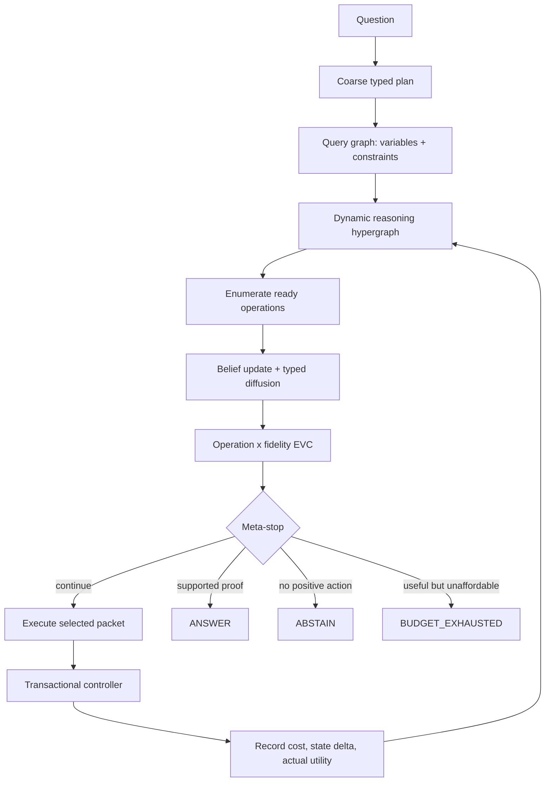

# TDCA：动态推理超图上的自适应计算

> **论文级方法说明与实现白皮书**
> 方法名：**TDCA: Adaptive Computation over Dynamic Reasoning Hypergraphs**
> 当前实现：Dynamic Hypergraph TDCA v2.2
> 文档基准日期：2026-08-24
> 研究状态：无训练开发原型；MuSiQue development-50 已完成，heldout 仍封存；本文不作 SOTA 声明

本文沿用项目代号 **TDCA**。它研究的不是如何让语言模型生成更长的思维链，而是：在有限推理预算下，如何显式维护一个不断变化、允许不确定性和冲突共存的推理状态，并让这个状态决定下一单位计算应投向哪里。本文是自包含说明；读者无需阅读代码，也应能够理解 TDCA 的问题定义、设计动机、状态表示、执行算法、约束、实验协议、当前证据与尚未解决的问题。

---

## 摘要

多跳问答要求系统从多个证据片段中发现中间实体、绑定变量、组合关系并形成可核验的最终答案。标准 RAG 通常一次性检索和生成；迭代 RAG 虽然交替执行检索与推理，但其内部状态往往仍是自由文本轨迹。静态分解方法把问题预先编译成依赖图，却难以修复遗漏步骤。更重要的是，上述方法通常没有回答一个独立问题：当多个子目标、候选链和验证动作同时存在时，有限计算应如何动态分配。

TDCA 将单题推理建模为一个随证据演化的 **Dynamic Reasoning Hypergraph**。图中包含类型化子目标、真实检索证据、候选 claim、答案节点、分支、冲突和多前提推导超边。每个节点保留彼此独立的绝对支持、候选间相对权重、熵、证据缺口、冲突压力、下游答案影响、依赖解锁价值和计算热度，而不是过早压缩为单一置信概率。证据支持沿推导方向传播；答案影响和计算需求反向传播到尚未解决的前提。系统据此为所有可执行操作构造不同 fidelity 的计算包，并通过归一化的、确定性加性 Expected Value of Computation（EVC）策略选择下一项检索、抽取、验证、JOIN、分支、图编辑、修正或提交操作。执行后，真实成本与图状态增益被写回同一题内的局部反馈统计，形成“预测价值—执行—观测收益—重新分配”的闭环。

TDCA 全程 training-free。Qwen-plus 只承担结构化规划、证据约束的 claim 提议、独立评分、关系 JOIN 验证和事件触发式结构提议；所有状态变化、候选融合、图扩散、调度、终局判定和安全约束均由确定性控制器执行。最终答案必须来自图中仍有效的完整证据链；否则系统明确返回 `ABSTAIN` 或 `BUDGET_EXHAUSTED`，而不是自由生成一个缺乏来源的答案。

在当前冻结的 MuSiQue development-50 上，v2.2 adaptive 配置达到 EM 0.520、F1 0.538、candidate presence 0.540、full-chain completion 0.580，并产生 12 个可审计的 3/4-hop JOIN 案例，其中 7 个 n-ary JOIN 被下游推理实际使用；unsupported answer 为 0。相较同一开发集上的冻结 v1，F1 提升 0.113，candidate presence 提升 0.120，full-chain completion 提升 0.100。然而严格研究 gate 仍未通过：uniform control 虽然质量更低且模型调用更多，但 adaptive 多使用了 6 次检索；fixed-order control 因开发活动总 API token 上限而只完成 31/50；matched budget curve 未完成。因此当前结果证明了机制可运行和开发集上的改进，但不能证明严格 Pareto 优越性、heldout 泛化或 SOTA。

---

## 1. 研究问题

### 1.1 多跳问答的真正困难

给定问题 $q$、语料或题内 distractor passages $\mathcal{D}$ 和总推理预算 $B$，多跳问答不仅要找到与问题相似的文档，还要构造一条从证据到答案的合法组合路径。例如：

```text
问题：电影 Inception 的导演出生在哪座城市？

证据 1：Inception was directed by Christopher Nolan.
证据 2：Christopher Nolan was born in London.

中间绑定：$director = Christopher Nolan
组合：directed_by(Inception, Nolan) + born_in(Nolan, London)
答案：London
```

失败可以发生在每一层：遗漏第一跳、抽取错误实体、把 source 和 object 的方向弄反、过早只保留一个 bridge candidate、无法显式组合两个正确事实、错误候选占用后续预算，或在最后自由生成时偏离已有证据。

TDCA 将这些失败统一解释为 **不确定状态下的过早承诺（premature commitment under uncertainty）**：

1. **规划承诺**：开始时固定完整 DAG；若缺少真实中间步骤，后续证据无法自然补回。
2. **候选承诺**：过早把单一候选写入 bridge variable，错误会污染后续查询。
3. **验证承诺**：一次二元 `verified/rejected` 决策可能永久删除暂时证据不足但正确的候选。
4. **终局承诺**：正确 claim 已存在，最终自由生成仍可能引入图外答案。
5. **计算承诺**：预先固定每个步骤的 token、检索深度与验证次数，使简单区域浪费预算、困难区域预算不足。

### 1.2 核心研究问题

本文关注：

> **How should an LLM dynamically maintain and allocate computation over uncertain reasoning states?**

更形式化地，系统在时刻 $t$ 有推理状态 $H_t$、剩余预算 $B_t$ 和可执行操作集合 $\mathcal{O}(H_t)$。目标不是最大化单步模型分数，而是学习之外、在推理时选择：

$$
(o_t,f_t)=\arg\max_{o\in\mathcal{O}(H_t),\,f\in\mathcal{F}(o)}
\widehat{\mathrm{EVC}}(o,f\mid H_t,B_t),
$$

其中 $o_t$ 是操作，$f_t$ 是局部计算 fidelity。执行得到观测结果 $y_t$、真实成本 $c_t$ 和新状态：

$$
H_{t+1}=\mathcal{T}(H_t,o_t,f_t,y_t),
$$

直到图中出现充分支持的答案，所有正价值计算消失，或预算不足以执行仍有价值的动作。

### 1.3 研究边界

TDCA 当前是 **单题内、training-free、结构化 working-memory reasoning 方法**，不是通用长期记忆 agent：

- 不训练或微调任何模型参数；
- 不在题间更新策略参数；
- persistent episodic memory 默认关闭；
- 不读取 gold answer、support labels、oracle decomposition 或 hop count；
- 不以增加 API 调用本身作为贡献；
- corpus memory 负责关联和召回，reasoning hypergraph 负责当前问题的证明状态，两者不混为一谈。

---

## 2. 方法主张与贡献

TDCA 的方法主张是：

> 推理结构不应只记录已经发生的推理；它应暴露尚未解决的不确定性、证据缺口和下游价值，并直接控制下一步计算的位置与规模。

围绕该主张，当前系统形成六个互相依赖的贡献点：

1. **动态而非静态的证明状态**：粗粒度初始计划只是起点；CandidateSet、分支、JOIN、revision 和 event-triggered editor 允许结构随证据变化。
2. **真正的多前提超边**：以 $\{c_1,\ldots,c_k\}\rightarrow c'$ 表达 conjunction、comparison、intersection 和 relational composition，而不是把多条普通边误当作联合推导。
3. **多通道信念表示**：绝对支持、相对竞争、熵、gap 和 contradiction 始终分开，避免把不可比较的信号提前压成单一概率。
4. **类型化双向传播**：support 向答案方向传播，answer impact 与 heat 向未解决前提反向传播，使计算需求成为图状态的一部分。
5. **图状态驱动的自适应计算**：EVC 同时选择操作和 fidelity，并记录 predicted EVC、预算请求、真实成本、状态变化与 actual utility。
6. **可证据追踪的安全终止**：答案是图节点，不是最后一步的自由文本；`ANSWER`、`ABSTAIN` 和 `BUDGET_EXHAUSTED` 语义分离。

这些是方法设计和机制实现的贡献。是否构成相对现有方法的经验优势，必须由完成后的 matched-compute、budget curve、heldout 和跨数据集实验决定；当前尚不能下此结论。

---

## 3. 系统总览

### 3.1 三种生命周期

TDCA 把“图”分为三个生命周期，避免 corpus graph、激活上下文和证明状态相互污染。

| 层 | 生命周期 | 内容 | 是否可变 | 作用 |
|---|---|---|---|---|
| Corpus memory | 跨题或题内语料生命周期 | passage、entity、alias 和浅层关联 | 推理时只读 | 提供非参数知识和关联入口 |
| Activated graph | 单题生命周期 | 当前查询激活的 passages、entities、跨层 grounding edges | 由真实检索追加 | 限制进入工作区的上下文并为 heat 提供种子 |
| Proof hypergraph | 单题生命周期 | subgoal、claim、answer、branch、contradiction、hyperedge、belief | 仅 controller 事务性修改 | 表示当前推理/信念状态并控制计算 |

Corpus memory 是 relation-light 的：它保留 passage—entity—alias 关联，却不把自动抽取关系永久写成“知识真值”。类型化语义关系只在 question-local proof layer 中建立，且必须带 evidence provenance。

### 3.2 端到端信息流



这条循环强调两个闭环：

- **认知闭环**：新 evidence 改变 claim、belief、branch 和 terminal gap；
- **资源闭环**：操作结果改变同一区域后续操作的 observed value、success posterior、empirical cost 和 cooldown。

### 3.3 LLM 与确定性系统的职责边界

| LLM 负责提议或判断 | 确定性系统负责决定和执行 |
|---|---|
| 粗粒度 typed plan | schema、变量和 DAG 校验 |
| evidence-grounded atomic claims | evidence ID/span 存在性和规范化 |
| 独立 raw verification channels | absolute/relative/entropy/gap 的计算与保留 |
| n-ary JOIN 语义验证 | JOIN 候选发现、端点统一、前提门槛、超边落图 |
| 命名事件后的结构扩展提议 | root 不变量、去重、cycle preflight、事务提交 |
| 不参与最终答案自由改写 | terminal belief conjunction 和三分终止 |

这一边界的目标不是假定 LLM 完全可靠，而是把 LLM 置于“受证据和 schema 约束的 proposer/scorer”角色中，让可审计控制器拥有最终状态权。

---

## 4. 形式化状态表示

### 4.1 Query Graph

初始 planner 输出至多两个明显子目标加一个 root objective。随后系统将计划编译为查询图：

$$
G_q=(\mathcal{V}_q,\mathcal{C}_q),
$$

其中变量 $z\in\mathcal{V}_q$ 包含 variable ID、所属 subgoal、期望类型和角色；约束 $c\in\mathcal{C}_q$ 包含自然语言关系描述、输入变量、输出变量和问题中已知实体。查询图负责回答：当前缺少哪个 slot、哪些变量已经绑定、哪条约束尚未执行。

执行依赖另存为 DAG：

$$
G_{\mathrm{exec}}=(V_s,E_{\mathrm{dep}}),
$$

只有当一个 subgoal 的所有依赖都已在当前 branch 中绑定时，它才是 executable。结构化 belief graph 可以包含 contradiction 与 revision 联系，但 execution dependency 永远不得成环。

### 4.2 Dynamic Reasoning Hypergraph

时刻 $t$ 的状态定义为：

$$
H_t=(V_t,\mathcal{E}_t,\mathcal{B}_t,\Pi_t,\mathcal{L}_t),
$$

其中：

- $V_t=V_s\cup V_c\cup V_e\cup V_a$：四类节点；
- $\mathcal{E}_t$：多前提推导超边及普通 grounding/dependency 联系；
- $\mathcal{B}_t$：每个节点的多通道 belief state；
- $\Pi_t$：active/completed/archived branches 及其变量绑定；
- $\mathcal{L}_t$：operation、diffusion、allocation、JOIN、revision、supersession、termination 等不可删除的审计历史。

#### SubgoalNode

表示未解决、部分解决或已完成的目标，核心内容包括问题模板、实例化问题、依赖、变量绑定、答案类型、terminal 标记、状态、不确定性和 provenance。root subgoal 始终保存原始任务语义；编辑器不能用局部子目标替换它。

#### EvidenceNode

只能由真实 retriever 结果创建，保存 document/passage ID、标题、原始文本 span、raw retrieval score、rank、query、retriever identity、目标 subgoal 与 branch。LLM 无权虚构 EvidenceNode。

#### ClaimNode

表示一个候选原子事实或 JOIN 结论：

$$
c=(s,r,v,\tau,z,\pi,\mathcal{E}_c,\mathcal{D}_c),
$$

其中 $s,r,v$ 为 subject、relation 和 projected value，$\tau$ 为答案类型，$z$ 为目标 subgoal，$\pi$ 为 branch，$\mathcal{E}_c$ 为证据引用，$\mathcal{D}_c$ 为依赖 claim。claim 还保存原始 source triple、抽取方向、canonical IDs、type lineage、join depth/signature 和 revision history。

当答案值在原文三元组的 subject 位置时，系统会规范化反转 projected tuple，使 `value` 始终表示当前 slot 的答案，同时保留未经修改的 source triple 作为 provenance。该规则是统一的方向语义，不依赖题目或实体。

#### AnswerNode

答案节点包含 candidate answer、答案类型、支持 claims、支持 evidence、derivation edge、branch、绝对支持、类型一致性、冲突风险和状态。它只能从仍有效的证明闭包中创建；最终输出是对 AnswerNode 的确定性渲染。

### 4.3 Hyperedge

超边写为：

$$
e=(S_e,v_e,\rho_e,\gamma_e,\mathcal{P}_e),\qquad 2\le |S_e|\le 4,
$$

其中 $S_e$ 是 premise node set，$v_e$ 是结论，$\rho_e$ 是 inference type，$\gamma_e$ 是支持强度，$\mathcal{P}_e$ 保存 supporting evidence、创建操作和验证来源。

普通边 `A → C` 与 `B → C` 不能说明 A、B 必须联合成立；超边 `\{A,B\} → C` 才表示 conjunction。当前 JOIN 支持：

- value-to-subject 与 subject-to-value 的关系路径连接；
- shared subject / shared value 约束；
- 显式 set member 与非空集合交；
- numeric argmax/argmin comparison；
- 2–4 元连接，以及由 nested JOIN 构成的 3/4-hop proof。

### 4.4 Branch

一个 branch 保存 parent、变量到 claim 的 assignments、已完成 subgoals、分支分数、状态与 revision history。多个 plausible candidate 不会立即全部展开；只有候选确实导致不同下游 query，且 top margin/entropy 表明歧义，系统才在全局 branch cap 内进行 lazy branching。

### 4.5 多通道 Belief State

每个节点维护：

$$
b_v=(a_v,r_v,H_v,g_v,c_v,i_v,u_v,q_v,h_v),
$$

分别表示：

- $a_v$：absolute support，候选自身被证据支持的强度；
- $r_v$：relative weight，只描述实际答案候选间竞争；
- $H_v$：candidate-set 或 terminal competition entropy；
- $g_v$：evidence gap；
- $c_v$：contradiction pressure；
- $i_v$：downstream answer impact；
- $u_v$：dependency unlock value；
- $q_v$：uncertainty；
- $h_v$：computation heat。

关键原则是这些量不被过早压成一个概率。例如，高 absolute support 但同时存在另一个同样强的答案时，relative margin 小、entropy 高；“证据充分但答案竞争未消除”与“候选自身没有证据”是不同状态，应触发不同计算。

---

## 5. 证据获取、claim 抽取与独立验证

### 5.1 依赖感知检索

检索 query 围绕当前 ready subgoal，而不是始终重复根问题。若 bridge variable 已绑定，则实例化后续模板；若图缺少某个端点，则 missing-binding query 明确请求该关系。系统支持 BM25、dense、hybrid 和 relation-light entity activation；当前 v2.2 开发配置使用 hybrid retriever、基础 top-k 10、自适应上限 15。

每轮检索：

1. 消耗一次 retrieval budget；
2. 保存全部 raw hit scores 和 ranks；
3. 按 passage ID 去重全局 hit；
4. 对同一 passage 在不同 query 下的激活分别保留 provenance；
5. 建立 passage—entity—proof evidence 的显式 cross-layer edges；
6. 把 activated entity 的 query overlap 与 evidence rank 作为 heat 种子，而不是直接当作答案置信度。

### 5.2 类型化原子 claim 抽取

抽取器只查看当前 subgoal、已绑定 dependency claims 和真实 evidence spans，输出严格结构化的 atomic claims。每个 claim 必须包含 exact quote/citation、subject、relation、value、answer position 和类型。系统拒绝未知 citation、空类型、无法映射的 span 或不合法 dependency。

抽取的第一目标是覆盖证据中与当前约束相关的原子关系，第二目标才是直接 answer projection。若已有 claim 但没有任何 claim 独立回答当前 slot，系统允许一次明确标记的 `direct_answer` projection 抽取；这不是题目补丁，而是统一的 slot-closure 操作。

### 5.3 Independent raw scoring

生成与验证分离。验证器对每个候选输出独立 raw channels：

$$
x_c=(G_c,E_c,T_c,D_c,R_c,C_c,M_c),
$$

分别为 grounding、relation entailment、type match、dependency consistency、retrieval support、contradiction risk 和 raw model confidence。确定性 evidence checks 与新的独立模型判断组合时，模型残差权重在当前开发配置中为 0.25；模型不能仅因候选“在集合中最好”而获得高 absolute support。

验证后才计算：

- absolute support：候选自身的证据支持；
- relative weight：同一真实 answer alternative set 内的相对竞争；
- set entropy：候选分布的不确定性；
- evidence gap：距离证据充分的缺口。

这些派生量与 raw channels 一起序列化。暂时较弱的候选可以 retained，而不是被一次模型输出永久删除。

---

## 6. 图级 Belief Update 与热传播

### 6.1 局部 belief 重算

每次 controller 接受操作后，仅从受影响节点出发求结构闭包，然后确定性重算局部 belief：

- evidence 的 support seed 取 $1/\text{rank}$；
- claim 的状态来自独立 score profile、冲突链接和可解锁下游结构；
- subgoal 聚合其 active candidates，同时保留竞争熵与 best evidence gap；
- answer 只有在 accepted 时才是 valid belief node；
- 每次实质变化提升 belief version，并记录 step 与 reason。

答案影响按离 terminal/root 的反向结构距离衰减。一个 claim 能解锁的 child subgoal 和可参与的 JOIN 越多，其 dependency unlock value 越高。

### 6.2 初始计算热度

对有效节点，局部初始热度为多通道加权平均：

$$
h_v^{(0)}=
\frac{
w_q q_v+w_i i_v+w_g g_v+w_c c_v+w_u u_v
}{w_q+w_i+w_g+w_c+w_u}.
$$

v2.2 初始开发权重为：

$$
(w_q,w_i,w_g,w_c,w_u)=(1.0,1.0,0.75,1.0,0.75).
$$

若节点是 activated passage，则 entity overlap 与 retrieval rank 产生 memory activation heat；最终 seed 取两者最大值。它表示“值得进一步计算”，不表示“事实为真”。

### 6.3 类型化、定向、多通道扩散

系统在 support、contradiction、answer impact 和 computation heat 等通道上建立不同方向的 messages。例如：

- evidence $\rightarrow$ claim：传播 support；
- claim $\rightarrow$ evidence：反向传播 evidence demand / answer impact；
- premise claims $\rightarrow$ JOIN result：传播组合支持；
- result $\rightarrow$ premises：传播答案影响与计算需求；
- dependency $\rightarrow$ consumer：传播解锁后的前向影响；
- unresolved consumer $\rightarrow$ dependency：把缺失计算需求向前提回传；
- contradiction links：传播 contradiction pressure。

对节点 $v$、通道 $c$，扩散迭代为：

$$
x_{v,c}^{(k+1)}=\operatorname{clip}_{[0,1]}\left[
r x_{v,c}^{(0)}+(1-r)\left((1-d)x_{v,c}^{(k)}+
d\operatorname{mean}_{u\rightarrow v}(w_{uvc}x_{u,c}^{(k)})\right)
\right].
$$

当前开发配置采用 restart $r=0.40$、decay $d=0.65$、最多 3 次传播、收敛阈值 $10^{-4}$。restart 防止图邻域完全覆盖本地观测；clip 保证所有通道有界。每轮 typed message、节点通道值、迭代数和最大变化量均写入 trace。

TDCA 所谓“热传播”的意义由此变得具体：它不是给节点叠加大量不透明 bonus，而是让尚未解决且接近终局的区域，把计算需求沿类型正确的结构方向传回可能解除瓶颈的 evidence、claim 或 subgoal。

---

## 7. Multi-hop JOIN Engine

### 7.1 候选发现

JOIN 候选由确定性结构规则枚举，而不是要求 LLM 在所有 claim 组合上盲搜。系统仅考虑：

- 当前 branch 内有效、已通过独立支持门槛的 claims；
- 类型兼容、端点可规范统一的关系；
- 连通的 query-constraint frontier；
- arity 2–4、depth 不超过 4 的候选；
- 不形成 lineage cycle 的组合；
- 能覆盖独立依赖、形成纯关系路径，或提供非冗余 shared-role constraint 的 n-ary 组合。

单个 premise 的 absolute support 必须至少达到 0.55。集合交必须能确定性找到非空公共成员。比较问题可使用明确的 numeric argmax/argmin 规则。结构等价候选允许 dominance pruning，但额外约束不能因为表面相似而被删除。

### 7.2 独立前提与组合语义

一个 n-ary JOIN 被接受必须满足：

1. 每个 premise 都有独立 grounding、entailment 和 absolute support；
2. premise 不是同一祖先的冗余复述；
3. variable binding 和 expected type 一致；
4. 每个声明的 constraint 都被结论使用；
5. 结论的 proof leaves 可追溯到真实 evidence；
6. 依赖 subgoal 的 chain 中必须同时含 dependency claim 和当前关系的 raw direct claim。

纯变量投影在端点和类型完全匹配时可确定性 materialize；真正的语义组合由 Qwen-plus 进行结构化验证，并要求逐项报告每个 premise 和 constraint 是否被使用。无论接受或拒绝，JOIN attempt 都记录 signature、premise versions、bindings、constraints、验证方式、reason、cost 和 downstream unlock。

### 7.3 嵌套证明示例

前述问题可形成：

```text
e1 ─supports→ c1: directed_by(Inception, Christopher Nolan)
e2 ─supports→ c2: born_in(Christopher Nolan, London)

{c1, c2}
    └─ relational_path / variable_binding →
       c3: answer_city(Inception.director.birth_place, London)

{c3} ─ answer_derivation → a1: London
```

若第一跳同时存在两个导演候选，系统可保留两个 CandidateSet 分支；后续证据和终局竞争决定继续验证哪条链，而不是在第一跳后不可逆地锁定一个字符串。

---

## 8. Event-Triggered Editing 与 Active Revision

### 8.1 Event-Triggered Graph Editor

初始计划故意保持粗粒度，编辑器只在命名事件出现时运行，例如：

- `missing_terminal_path`：没有可连接到 root 的结构路径；
- `high_uncertainty_no_join`：已有证据和 claims，但无法形成合法 JOIN。

编辑器只能提议新的 subgoal、变量和约束，或提出受限的 root repair；不能直接输出答案。控制器执行以下 preflight：

- 变量必须由已存在或同次合法新增的节点声明；
- dependency 必须存在；
- 新执行图必须仍为 DAG；
- 与已有 subgoal 重复的提议被拒绝；
- root objective 的语义和 terminal 身份不可被局部目标覆盖；
- 非法提议不得对原图产生任何部分修改。

### 8.2 Revision 触发

claim 在 commit 时保存 belief baseline。之后若出现：

$$
\begin{aligned}
\Delta a_c &\ge 0.20 &&\text{support collapse},\\
\Delta H_c &\ge 0.20 &&\text{entropy rise},\\
\Delta g_c &\ge 0.20 &&\text{evidence-gap rise},\\
c_c &\ge 0.70 &&\text{contradiction pressure},
\end{aligned}
$$

则 detector 产生 `REVISE` 操作。revision 不删除历史，而是：

1. 记录触发 claim、证据、版本和原因；
2. 使该 claim 及其 downstream closure 失效；
3. reject 依赖失效状态的 AnswerNode；
4. reopen 受影响 subgoal/branch；
5. 在 revision cap 与 cooldown 下允许新证据和候选重新进入竞争。

这一区分了“当时基于有限证据的合理 commit”和“后来证据到来后的主动修正”。

---

## 9. Adaptive Computation Allocation

### 9.1 可执行操作

控制器支持八类显式操作：

| 操作 | 语义 | 典型成本 |
|---|---|---|
| `EXPAND` | 事件触发的结构补全或受限修复 | LLM，高图增长风险 |
| `BRANCH` | 抽取 typed claims，或对歧义候选建立 lazy branches | LLM / 低成本确定性分支 |
| `RETRIEVE` | 为当前缺口执行新检索 | retrieval |
| `VERIFY` | 对 proposed claims 做独立多通道验证 | LLM |
| `MERGE` | 验证并 materialize n-ary JOIN | LLM 或确定性投影 |
| `PRUNE` | 在保留历史的情况下归档低价值状态 | 确定性 |
| `COMMIT` | 将满足条件的 claim 绑定到 branch/subgoal | 确定性 |
| `REVISE` | 失效传播、答案撤销和 subgoal reopen | 确定性 |

ready-set builder 先应用依赖、状态、证据、JOIN 和安全门槛，形成 $\mathcal{O}(H_t)$。调度器不能选择本来不可执行的动作。

### 9.2 Operation × Fidelity

对于可调动作，adaptive 模式构造 low/medium/high 三种 fidelity：

$$
f\in\{0.35,0.65,1.0\}.
$$

fidelity 控制 completion tokens、retrieval top-k、candidate cap、independent verification samples、branch width 和 revision allowance。由于 typed extraction 和 JOIN validation 的 JSON schema 具有不可再缩减的字段，当前实现将它们固定为 high；它们的适配发生在激活证据和候选数量，而不是用过小 token cap 产生不可解析 JSON。

对其他动作，预期收益采用次线性增益 $\sqrt{f}$，成本按 $f$ 缩放。这样低 fidelity 表示先购买一小单位高边际信息，而不是假定输出质量与 token 完全线性。

### 9.3 EVC 信号

每个 operation-fidelity packet 计算 12 个原始信号：

$$
z(o,f)=(h,u,a,d,n,r,o,c,g,k,t,p),
$$

其中：

- $h$：graph heat；
- $u$：预期 uncertainty reduction；
- $a$：answer impact；
- $d$：dependency unlock；
- $n$：evidence novelty；
- $r$：revision/recovery value；
- $o$：同一区域历史 observed value；
- $c$：expected cost；
- $g$：graph growth risk；
- $k$：failure cooldown；
- $t$：该操作对 terminal gap 的相关性；
- $p$：terminal proximity，接近可提交时避免无谓扩张。

不同量纲不能直接相加。因此每轮先在当前所有 operation × fidelity candidates 上对每个 component 做 min-max normalization，得到带波浪号的量，再计算：

$$
\begin{aligned}
\widehat{\mathrm{EVC}}(o,f)=\max\{0,\;&
w_h\tilde h+w_u\tilde u+w_a\tilde a+w_d\tilde d+w_n\tilde n+w_r\tilde r+w_o\tilde o\\
&-w_c\tilde c-w_g\tilde g-w_k\tilde k+w_t\tilde t+w_p\tilde p\}.
\end{aligned}
$$

v2.2 development weights 为：

| component | heat | uncertainty | impact | unlock | novelty | recovery | observed | cost | growth | cooldown | terminal gap | proximity |
|---|---:|---:|---:|---:|---:|---:|---:|---:|---:|---:|---:|---:|
| weight | 1.00 | 1.00 | 1.00 | 0.75 | 0.50 | 0.75 | 1.00 | 1.00 | 0.50 | 1.00 | 1.25 | 0.75 |

这些是冻结前的 initial development config，不是训练得到的参数，也不是已被证明为最优的理论常数。

### 9.4 真实收益与闭环反馈

执行后，系统比较操作区域的 pre/post summary，计算：

- uncertainty reduction；
- support gain；
- evidence-gap reduction；
- entropy reduction；
- dependency-unlock gain；
- evidence novelty；
- answer-chain progress；
- contradiction resolution；
- terminal-gap reduction；
- normalized actual cost。

正向分量先分别归一化，actual utility 定义为：

$$
U_{\mathrm{actual}}=
\operatorname{clip}_{[-1,1]}
\frac{\sum_j \lambda_j\Delta_j-\lambda_c\bar c}
{\sum_j\lambda_j+\lambda_c}.
$$

每条 allocation ledger 都保存 predicted EVC、raw/normalized components、requested budget、actual cost、state delta、actual utility、完成状态和失败原因。即使模型拒答、JSON malformed 或操作没有推进图，也不能从成本账本中消失。

反馈 key 由 operation family、target region、branch、source-node set 和结构上下文共同确定。先验强度为 2，value/success 初始均为 0.5。只允许相同 question、相同因果区域的历史结果影响后续选择；family-wide 汇总只用于审计，不能把一个 subgoal 的失败错误迁移到另一个 subgoal。连续两次失败触发两 step cooldown。新题始终从同一先验开始，因此这不是跨题学习或隐式训练。

### 9.5 对照策略

同一图引擎暴露三种 allocator：

- `adaptive_evc`：按上述 EVC 排序并选择 fidelity；
- `uniform`：所有候选赋相同效用，按生成顺序执行；
- `fixed_order`：按固定 operation priority 排序。

只有三者使用完全相同的样本顺序、模型、retriever、非 allocator 配置、全局 cap 和缓存隔离时，才能做 matched-compute 结论。

---

## 10. Terminal Belief 与 Meta-level Stop

### 10.1 为什么不能只取最高分候选

最终答案需要同时满足自身证据、候选竞争、证明完整性和类型约束。系统对相同规范化 answer 聚合 absolute support，并只在 terminal candidate set 内计算 relative weight、top-2 margin 和 normalized competition entropy。

对某条 candidate proof chain：

- chain absolute support 取链上 claims 的最小值；
- evidence gap 取链上最大值；
- contradiction 取 raw 与 belief pressure 的最大值；
- chain coverage 从 root 沿 execution dependencies 检查全部 branch assignments；
- joined claim 必须有仍 active 的 hyperedge；
- unknown branch 或可信未决竞争分支 fail closed。

### 10.2 合取式答案门槛

当前开发门槛为：

$$
\begin{aligned}
a &\ge 0.70, &\text{relative margin}&\ge 0.20,\\
H &\le 0.50, &g&\le 0.50,\\
c &\le 0.70, &\text{type consistency}&\ge 0.80,\\
\text{chain coverage}&=1.00.&&
\end{aligned}
$$

它们是合取条件，不被再融合成一个概率。`terminal_gap` 定义为各个归一化门槛违反量的最大值，因此代表“离可接受证明最远的那个瓶颈”；它用于调度，不代表答案为真的概率。

### 10.3 三分终止

MetaStopPolicy 只返回：

1. **`ANSWER`**：存在 active、完整、通过所有 terminal gates 的 AnswerNode；
2. **`ABSTAIN`**：不存在正 EVC 的可执行操作，或 best EVC 不高于 0.08；
3. **`BUDGET_EXHAUSTED`**：仍有正价值动作，但剩余 call/token/retrieval/graph budget 不足。

这三个结果具有不同含义。特别地，预算耗尽不能降级为“把当前最好字符串当答案”，基础设施失败也不能伪装为正常 abstention 指标。

---

## 11. 事务控制、安全不变量与防泄漏

### 11.1 Controller-only mutation

所有组件只能产生 `GraphOperation` 提议。唯一状态转移入口是事务控制器：

$$
\mathcal{T}(H,o)=
\begin{cases}
H', & \text{preflight、apply、post-validation 均通过},\\
H, & \text{否则拒绝且不产生部分修改}.
\end{cases}
$$

每次成功操作保存 before/after state hash、created/updated/invalidated IDs、operation ID 和来源。序列化 state 由 controller hash 封印；外部直接修改后再次验证会失败。

### 11.2 主要不变量

系统至少检查：

- execution dependency graph 必须为 DAG；
- node、edge、operation、allocation ID 唯一；
- evidence citation 必须指向真实检索节点；
- claim 必须有合法类型和 target；
- active joined claim 必须存在对应多前提 hyperedge；
- hyperedge source/target 存在且不得形成 derivation lineage cycle；
- accepted answer 的 supporting claim/evidence/edge 全部 active；
- revision 后不存在由 invalid state 支持的 accepted answer；
- allocation record 包含完整 EVC、预算、成本和 outcome；
- graph node、edge、branch、revision、depth、operation、retrieval 都不超过显式 cap。

### 11.3 Leakage boundary

推理入口只接收 question、qid 和公开 passages。gold answer、supporting facts、decomposition、hop label 与 evaluation metadata 只在预测完成后用于指标和机制诊断。禁止：

- 题号、实体、答案或 gold evidence 特定规则；
- inference 期间读取 oracle 字段；
- 跨题 adaptive state；
- heldout 后调参；
- 通过手动修改 status 绕过 machine gate。

API key 仅从环境变量读取，不进入配置、manifest、cache key、trace 或仓库。

---

## 12. 完整推理算法

### Algorithm 1：Graph-state-driven TDCA inference

**输入**：问题 $q$，检索器 $R$，只读语料记忆 $M$，模型 $L$，预算 $B$。
**输出**：`ANSWER(a)`、`ABSTAIN` 或 `BUDGET_EXHAUSTED`，以及完整审计轨迹。

1. 创建 root branch 和空的 Dynamic Reasoning Hypergraph；封印初始 controller state。
2. 让 planner 提议粗粒度 typed plan；校验变量、类型和 execution DAG。若结构化输出失败，使用通用 direct-root fallback。
3. 编译 query variables 与 constraints，初始化 node beliefs。
4. 在每个 policy iteration：
   1. 从 graph state 检测 revision triggers；
   2. 枚举已完整支持的 terminal candidates 并计算 terminal belief；
   3. 若没有可直接接受答案，则对每个 active branch 和 ready subgoal 依次产生可执行动作：缺 evidence 则 retrieve；有 proposed claim 则 verify；无 claim 则 typed extraction；有依赖和直接关系则 discover JOIN；可提交则 commit；歧义且会影响下游则 branch；仍无路径则 event-triggered expand；
   4. 在受影响闭包上更新 beliefs，执行 typed directional diffusion；
   5. 为每个 operation × fidelity 计算 raw signals、逐分量归一化和 predicted EVC；
   6. MetaStop 判断是否 `ANSWER`、`ABSTAIN`、`BUDGET_EXHAUSTED` 或继续；
   7. 执行最高 EVC 且 affordable 的 packet。LLM 只返回提议，controller 原子提交；
   8. 测量 logical calls、tokens、retrievals 和图变化；记录 actual utility 与局部 posterior feedback；
   9. 返回步骤 4.1，直至终止或 policy safety cap。
5. 由 controller 写入唯一 termination record；若为 `ANSWER`，只渲染 accepted AnswerNode 的值。

### 复杂度与有界性

设图有 $n$ 个 nodes、$m$ 条普通/超边展开联系、ready packets 为 $p$、JOIN frontier 为 $J$：

- 一次局部 closure 和 belief update 最坏为 $O(n+m)$；
- 一轮定步数 diffusion 为 $O(K(n+m))$，当前 $K\le3$；
- component normalization 与 packet ranking 为 $O(p\log p)$；
- JOIN 枚举理论上随 arity 组合增长，但通过 frontier cap、arity、depth、support、connectivity 和 attempt cap 有界；
- LLM 成本由 per-question 与 campaign 双层预算硬限制。

当前单题 safety caps 为 16 logical LLM calls、16,000 logical tokens、8 retrievals、最多 192 policy iterations、64 graph operations、128 nodes、192 hyperedges、3 active branches、每 subgoal 12 candidates、6 JOIN attempts、4 graph revisions 和 depth 8。这些是开发安全上限，不是正式 matched-compute 预算声明。

---

## 13. 与相关工作的关系

### 13.1 Iterative RAG

[IRCoT](https://aclanthology.org/2023.acl-long.557/) 将 chain-of-thought 与检索交错，使后续 retrieval 依赖此前推理。TDCA 继承“推理决定下一轮检索”的思想，但用 typed claim、variable binding、proof hyperedge 和 terminal gates 代替自由文本轨迹，并进一步在多个可执行动作间分配 fidelity。

### 13.2 Graph memory 与 GraphRAG

[HippoRAG](https://papers.nips.cc/paper_files/paper/2024/hash/6ddc001d07ca4f319af96a3024f6dbd1-Abstract-Conference.html) 使用知识图和 Personalized PageRank 强化长期非参数记忆中的关联检索。TDCA 不试图替代它：HippoRAG 更接近 corpus-level associative retrieval，TDCA 关注 question-local proof construction 和 computation allocation。HippoRAG/HippoRAG 2 可以作为 TDCA 的 retriever baseline 或前端，而不能因两者都使用“图”就视为同一方法。

[G-Retriever](https://papers.nips.cc/paper_files/paper/2024/hash/efaf1c9726648c8ba363a5c927440529-Abstract-Conference.html) 研究在图问答中检索紧凑子图；[Superposition Prompting](https://proceedings.mlr.press/v235/merth24a.html) 通过并行 prompt paths 与早期丢弃减轻长上下文成本。TDCA 借鉴“只激活相关区域”和“不同路径应有不同计算量”的原则，但把资源对象扩展到检索、抽取、验证、JOIN、revision 和结构编辑。

### 13.3 图上可解释推理与证据链

[RoG](https://proceedings.iclr.cc/paper_files/paper/2024/hash/3e2aeb66481dd63a32421bf032b70384-Abstract-Conference.html) 使用 relation paths 进行 KG-grounded planning/retrieval/reasoning；[Think-on-Graph](https://proceedings.iclr.cc/paper_files/paper/2024/hash/10a6bdcabbd5a3d36b760daa295f63c1-Abstract-Conference.html) 通过图搜索支持深层、可追踪推理；[TRACE](https://aclanthology.org/2024.findings-emnlp.496/) 从检索文本构建 knowledge-grounded reasoning chains。TDCA 的差异在于其 graph 不是固定外部 KG，也不只是最终 evidence chain：它是允许候选竞争、冲突、revision 和 allocation feedback 的在线 belief state。

### 13.4 Test-time computation

[Scaling LLM Test-Time Compute Optimally](https://openreview.net/forum?id=4FWAwZtd2n) 表明按问题难度自适应分配 test-time compute 可以比固定 best-of-N 更高效。TDCA 将类似问题转化到 multi-hop RAG：计算不只是在同一 prompt 上多采样，而是在结构不同的 reasoning operations 和 graph regions 间分配。当前 EVC 是 training-free 的显式代理策略，不使用训练后的 process reward model。

### 13.5 TDCA 的独特交叉点

现有工作分别强化检索图、推理路径、上下文压缩或 test-time search。TDCA 的预期论文位置是它们的交叉：

```text
Dynamic belief/proof state
        ×
Explicit multi-premise composition
        ×
Graph-conditioned test-time compute allocation
        ×
Fail-closed evidence-grounded termination
```

这一定位仍是待完整实验验证的研究假设，而不是当前结果已经建立的 SOTA 事实。

---

## 14. 实验设计与评价协议

### 14.1 数据、模型与冻结原则

- 主开发集：MuSiQue distractor，固定 seed `20260820`；
- split：相互分离的 smoke-20、development-50、heldout-200；
- 模型：Qwen-plus，temperature 0；
- 训练：无；
- 开发只允许使用 smoke/development；
- hard gate 全部通过后才冻结配置并只运行一次 heldout-200；
- heldout 后禁止调参；
- HotpotQA、2WikiMultiHopQA 使用同一冻结参数和各自 disjoint manifests；
- 正式比较需包含 BM25/Dense/Hybrid RAG、IRCoT、Structured TDCA、legacy TDCA，以及按官方代码和固定 commit 运行的 HippoRAG/HippoRAG 2 adapter。

### 14.2 质量、机制和成本指标

仅报告 EM/F1 不足以判断 TDCA。指标分四组：

1. **答案质量**：EM、token F1、answered rate、selective accuracy；
2. **检索/链完整性**：support precision/recall、all-gold-document recall、ordered evidence path recall、answer-in-context、candidate presence、full-chain completion；
3. **机制真实性**：accepted n-ary JOIN、downstream-used JOIN、revision precision/recall/FPR、non-uniform allocation、feedback-influenced-later-allocation、complete terminal belief；
4. **计算成本**：logical LLM calls/tokens、retrieval calls、provider attempts/reported tokens、延迟和失败。缓存 replay 与真实 HTTP 成本必须分开。

### 14.3 Hard Gate

最终 gate 是合取式的，必须全部通过：

| 范畴 | 条件 |
|---|---|
| Infrastructure | zero leakage；zero invariant violation；controller-only mutation；zero unaccounted provider calls；complete serialization |
| Reasoning | F1 不低于冻结 v1；candidate presence ≥ v1 + 0.10；full-chain ≥ v1 + 0.10；至少 3 个可审计 3/4-hop JOIN；至少 3 个 downstream-used n-ary JOIN |
| Dynamic behavior | adversarial revision 通过；VitaminC evaluation-60 precision ≥ 0.80、recall ≥ 0.60、FPR ≤ 0.10；存在 non-uniform allocation；actual outcome 影响后续 allocation |
| Allocation | EVC/terminal-gap trace 完整；predicted EVC、actual cost、utility 与 state delta 完整；adaptive/uniform/fixed-order matched；budget curve 完整；adaptive 对两个 control 存在严格 Pareto improvement |
| Termination | unsupported answer = 0；三种终止可分；terminal belief 与 sufficient support chain 完整 |

gate evaluator 读取真实 artifacts 计算结论；修改 JSON 状态位不能打开 heldout runner。

---

## 15. 当前 v2.2 结果

### 15.1 Adaptive development-50

当前选定 run 的核心结果为：

| 指标 | 结果 |
|---|---:|
| EM | 0.5200 |
| F1 | 0.5378 |
| Answered | 0.5800（29/50） |
| Selective accuracy | 0.8966 |
| ABSTAIN | 0.3600（18/50） |
| BUDGET_EXHAUSTED | 0.0600（3/50） |
| Candidate presence | 0.5400 |
| Full-chain completion | 0.5800 |
| Answer in retrieved context | 0.8600 |
| All-gold-document recall | 0.7400 |
| Ordered evidence-path recall | 0.6733 |
| Support precision / recall | 0.1944 / 0.8917 |
| Auditable 3/4-hop JOIN cases | 12 |
| Downstream-used n-ary JOIN cases | 7 |
| Unsupported accepted answers | 0 |
| Non-uniform allocation | 1.0000 |
| Complete EVC trace | 1.0000 |
| Outcome feedback influenced later allocation | 0.2600 |
| Complete terminal belief/gap trace | 1.0000 |
| Logical calls / tokens / retrievals | 336 / 330,308 / 149 |

高 selective accuracy 与零 unsupported answer 表明终局 gate 很保守：一旦回答通常可靠，但 42% 的题没有形成可接受答案。support recall 很高而 precision 仅约 0.19，说明检索上下文仍然噪声较多；answer-in-context 0.86 高于 candidate presence 0.54，说明大量失败发生在“答案已在上下文中”之后，即 claim 抽取、方向投影、变量绑定、JOIN 或 terminal chain closure 阶段，而不只是初始 retrieval。

### 15.2 相对冻结 v1 的架构进展

| 方法 | EM | F1 | Candidate presence | Full-chain | Logical calls | Logical tokens | Retrievals |
|---|---:|---:|---:|---:|---:|---:|---:|
| Frozen Dynamic v1/A6 | 0.420 | 0.424 | 0.420 | 0.480 | 349 | 328,702 | 160 |
| Dynamic v2.2 adaptive | **0.520** | **0.538** | **0.540** | **0.580** | **336** | 330,308 | **149** |
| 差值 | +0.100 | +0.113 | +0.120 | +0.100 | -13 | +1,606 | -11 |

v2.2 达到了预先设定的 reasoning capability thresholds，也证明 n-ary JOIN 不只是单元测试接口：至少 7 个案例被后续链真正消费。然而这是同一 development-50 上的多轮方法开发结果，可能包含 development overfitting，不能替代 heldout 证据。

### 15.3 Adaptive 与 uniform control

| Allocation | F1 | Logical calls | Logical tokens | Retrievals | 状态 |
|---|---:|---:|---:|---:|---|
| Adaptive EVC | **0.5378** | **336** | **330,308** | 149 | complete |
| Uniform | 0.3878 | 352 | 367,790 | **143** | complete |

adaptive 在 F1、logical calls 和 logical tokens 上更好，但 retrievals 多 6 次。因此在预注册的“所有主要成本轴零容忍”规则下，它不是严格 Pareto point。更不能使用 provider calls 进行公平对比：选定 adaptive run 大量命中 warmed cache，只有 2 个真实 provider requests；uniform cold arm 有 341 次。逻辑调用/逻辑 token 可描述算法工作量，但正式 provider-cost 对照必须使用隔离且一致的 cache policy 重跑。

### 15.4 安全停止

fixed-order arm 在 31/50 时停止，因为整个开发 campaign 达到 provider token preflight cap。总使用量：

- 2,428 / 2,500 provider attempts；
- 2,495,753 / 2,500,000 provider-reported tokens；
- pending requests = 0；
- budget curve 未启动；
- heldout 未启动。

因此当前 hard gate 的明确失败项是：

1. fixed-order control 未完成；
2. adaptive 未在每个 primary cost axis 上严格支配 uniform；
3. 无法对 incomplete fixed-order 建立 Pareto 结论；
4. matched budget curve 未完成。

截至本文版本，**TDCA v2.2 是机制完整、开发集能力显著提升但实验证据尚未闭合的原型**。

---

## 16. 当前缺陷与有效性威胁

### 16.1 核心算法缺陷

1. **EVC 仍是手工代理，不是经因果验证的 value model。** component 有清楚语义且可审计，但其权重、operation reduction、base cost 和 fidelity gain 仍是开发配置。non-uniform allocation 只证明策略在变化，不证明变化方向最优。
2. **min-max normalization 依赖当前 ready set。** 候选集合变化会改变相同 raw signal 的相对值；singleton 或窄 ready set 时区分能力有限。未来需要 rank-stable、跨步骤可比较的 normalization 或显式 constrained optimization。
3. **扩散有效性尚未被独立消融证明。** 传播方向和有界性明确，但“扩散后的 heat 是否优于局部 heat、uniform heat 或无 diffusion”仍需 matched ablation。
4. **belief 数值尚非统计校准概率。** absolute support 与 evidence gap 是保守的确定性/模型混合指标，不能解释为频率校准概率。当前 terminal gate 更像安全判定器。
5. **JOIN 语义覆盖仍有限。** 已支持路径、集合交和数值比较，但时序、计数、否定、复杂集合关系和隐式共指仍可能无法通过端点统一发现。
6. **结构编辑器自然贡献不足。** 安全 preflight 已实现，但当前自然数据上它能否稳定补出 planner 遗漏的关键约束，缺少足够下游成功案例。
7. **自然 revision 稀疏。** VitaminC 控制套件已有可接受结果（precision 0.926、recall 0.833、FPR 0.067），对抗性 revision 机制也可执行；但自然 MuSiQue development-50 的 revision count 为 0，尚不能证明真实 QA 中的 active self-correction 收益。
8. **检索噪声高。** support recall 0.892 与 precision 0.194 并存，说明更多检索可能提高覆盖，却会加重抽取、验证和调度负担；adaptive 比 uniform 多 6 次 retrieval 正反映这一矛盾。

### 16.2 实验有效性威胁

1. development-50 被多轮用于诊断和修改，存在明显开发集过拟合风险；
2. fixed-order 和 budget curve 不完整，核心 adaptive-compute claim 尚未闭合；
3. provider cache 状态不匹配，不能用当前 HTTP 次数作正式成本结论；
4. 当前 v2.2 主要证据来自 MuSiQue 与 Qwen-plus，模型、数据集和 retrieval setting 泛化未知；
5. HippoRAG/HippoRAG 2、IRCoT 等尚无与 v2.2 同一最终配置下的完整 matched comparison；
6. 50 条样本上的 JOIN case 数能证明机制存在，但不足以估计稳定收益和按 hop 的置信区间；
7. 没有 sealed heldout 结果，因此任何“优于 baseline”“泛化提升”或 “SOTA”陈述都不成立。

### 16.3 工程与复现限制

- API structured-output failure 仍会消耗预算；部分 stage 有通用 deterministic fallback，但不能恢复所有语义覆盖；
- 开发 cap 可能在困难题上截断仍有价值的链；提高 cap 又会扩大成本，需要 budget curve 而非单点判断；
- Qwen API token accounting、logical tokens 与缓存后的 provider tokens 是不同口径，报告时必须并列说明；
- 当前 README 的 v2 状态描述早于 v2.2 campaign，应以本文和 machine safe-stop record 为准。

---

## 17. 下一阶段研究路线

### P0：先闭合实验，而不是继续无边界调参

在新 preregistered campaign 中：

1. 隔离 adaptive、uniform、fixed-order 的 cache namespace；
2. 使用完全相同 ordered IDs 和非 allocator config 完成 fixed-order 50；
3. 完成至少 4 个预算点的 matched budget curve；
4. 同时画质量—logical tokens、质量—LLM calls、质量—retrievals 和质量—provider tokens 曲线；
5. 对“retrieval 多 6 次”的现象采用预算约束，而不是事后改变 Pareto 规则；
6. hard gate 未通过前继续封存 heldout。

这是当前最高优先级，因为缺失证据直接关系到论文的核心主张“图状态可以更有效地分配计算”。

### P1：从排序式 EVC 推进到预算约束的分配策略

当前 allocator 每轮选择最高分 packet。下一版应研究：

- 在 calls/tokens/retrievals 多资源约束下的 constrained EVC；
- 对同一 region 的 marginal return curve，而不只使用固定 $\sqrt f$；
- 预测 calibration：比较 predicted EVC 与 actual utility 的 reliability；
- operation-level regret：所选动作与事后最佳动作的差距；
- terminal bottleneck attribution：由 support、entropy、gap、type 或 chain coverage 分别决定最合适的操作；
- 检索预算 shadow price，使额外 retrieval 只有在足以改善 Pareto frontier 时被选择。

仍应保持 training-free；可以使用题内 Bayesian updating、bandit/UCB 或 deterministic constrained search，但不得把 development labels 拟合进 policy。

### P2：提高“answer 已在 context 中”之后的转换率

0.86 answer-in-context 对 0.54 candidate presence 是当前最大的质量缺口。应优先研究通用机制：

- evidence span first 的 coverage-aware atomic extraction；
- claim orientation 与 answer-slot projection 的统一 type algebra；
- 从 query constraints 反向要求缺失 relation，而不是仅抽取高显著事实；
- 对 provider truncated/malformed output 的 schema-safe 分块抽取；
- proof frontier 上的 targeted verification，减少对无关 claims 的重复评分；
- 将 JOIN rejection reason 反馈为下一轮 evidence query 或 extraction constraint。

禁止重新引入题目、实体、关系短语或 qid 特定补丁。

### P3：让 diffusion 的因果价值可验证

至少进行以下 matched ablations：

1. no diffusion；
2. local heat only；
3. untyped/symmetric diffusion；
4. typed directional diffusion；
5. 去除 backward answer impact；
6. 去除 contradiction channel；
7. 不同 steps/restart/decay 的稳定性分析。

报告重点不只是 EM/F1，还包括资源是否真的从低价值区域迁移到阻塞 terminal proof 的 region。

### P4：建立自然 revision 评估

VitaminC 能测试 contradiction detector，却不能替代完整多跳 QA 中的 revision。需要构建或采用具有以下事件的公开协议：

- 早期 evidence 支持 A，后续更强 evidence 推翻 A；
- competing entity 导致不同下游 query；
- revision 后需要撤销已 materialize JOIN 和 AnswerNode；
- positive 与 non-revision controls 成对，评价 precision、recall、FPR、恢复后答案质量和额外成本。

### P5：冻结后做泛化和强 baseline

只有 P0–P4 的 development gate 通过后：

1. 冻结所有参数、prompt 和 source fingerprint；
2. 单次运行 MuSiQue heldout-200；
3. 在不改参数的情况下运行 HotpotQA 和 2WikiMultiHopQA；
4. 与 IRCoT、Structured TDCA、HippoRAG/HippoRAG 2 和简单 RAG 做 matched comparison；
5. 使用 paired bootstrap、按 hop/type 分层、selective risk-coverage 和成本 Pareto 曲线；
6. 只有 heldout 与跨数据集证据一致时，才讨论论文级 superiority claim。

---

## 18. 如何理解当前 TDCA

TDCA 不是“在 RAG 后面再加几个 agents”，也不是“把思维链画成图”。它可以用一句话概括为：

> **把多跳推理表示成可修正、可验证的动态 belief/proof hypergraph，并把图上的未决程度、答案影响和证据缺口转化为题内的边际计算决策。**

从研究演进上看：

```text
Legacy TDCA
  温度/扩散启发式 + 单体调度器
        ↓
Structured TDCA
  静态 dependency DAG + typed working memory + expected utility
        ↓
Dynamic Hypergraph TDCA v1
  CandidateSet + branch + hyperedge + revision/editor + normalized scheduler
        ↓
Dynamic Hypergraph TDCA v2.2（当前）
  typed belief diffusion + explicit n-ary JOIN
  + terminal belief gap + operation×fidelity EVC
  + actual-outcome feedback + fail-closed meta-stop
        ↓
最终研究目标
  在 matched-compute 与 heldout 上证明：
  graph state 对计算的分配优于 uniform/fixed policies，
  且形成稳定的质量—成本 Pareto 改进
```

因此，“图管理 reasoning”已经基本实现；“图状态在严格实验中被证明能更优地控制算力”仍是尚未完成的最终命题。

---

## 19. 复现索引与事实来源

本文的设计与结果对应以下机器可读或版本化记录：

- 方法与不变量：`docs/dynamic_hypergraph_tdca_v2.md`
- v2.1 研究设计：`docs/dynamic_hypergraph_tdca_v21_design.md`
- 历史及 v2.2 汇总：`docs/dynamic_hypergraph_results_20260820.md`
- v2.2 safe-stop record：`docs/dynamic_v22_safe_stop_20260824.json`
- v2.2 preregistration：`configs/dynamic_v22_preregistration.json`
- v2.2 hard gate：`configs/dynamic_v22_hard_gate.json`
- campaign API ledger：`analysis_outputs/dynamic_v22_campaign/campaign_budget.json`
- selected adaptive run：`research_outputs/musique_distractor_development_dynamic_hypergraph_tdca_v2_1787576014510858381`
- uniform control：`research_outputs/musique_distractor_development_dynamic_hypergraph_tdca_v2_1787576302966561464`
- interrupted fixed-order control：`research_outputs/musique_distractor_development_dynamic_hypergraph_tdca_v2_1787578519457017249`

复现时必须保存 resolved config、代码 fingerprint、split manifest、environment、predictions、retrieval traces、reasoning traces、graph snapshots、metrics、cost summary、failures、partial progress 和 checksums。任何只保留最终答案而无法重建 allocation/JOIN/terminal belief 的运行，都不足以支撑 TDCA 的机制性结论。

---

## 20. 结论

TDCA 提出一种 training-free 的多跳推理框架：用动态推理超图保存不确定候选、真实证据、多前提组合、冲突和终局证明；用多通道 belief 与类型化扩散定位计算瓶颈；用 operation × fidelity EVC 在检索、抽取、验证、JOIN、revision 和结构编辑之间分配有限预算；用实际状态增益闭环修正同题内的后续分配；最终只从完整 active proof 中输出答案。

当前 v2.2 已经跨过“只有接口、没有真实组合和反馈”的阶段：n-ary JOIN、graph-level update、typed diffusion、outcome-conditioned allocation、terminal belief 和安全终止均有自然运行轨迹，开发集质量也明显超过冻结 v1。然而核心论文命题仍差最后也是最重要的一步——在公平、完整、缓存隔离的 matched-compute 与 budget curve 上证明严格 Pareto 改进，并在一次封存 heldout 与跨数据集测试中复现。只要这一证据链尚未闭合，最准确的表述仍应是：**TDCA 是一个有明确研究假设、机制完整且具有积极开发信号的候选方法，而不是已经被证明优于现有 SOTA 的最终算法。**
